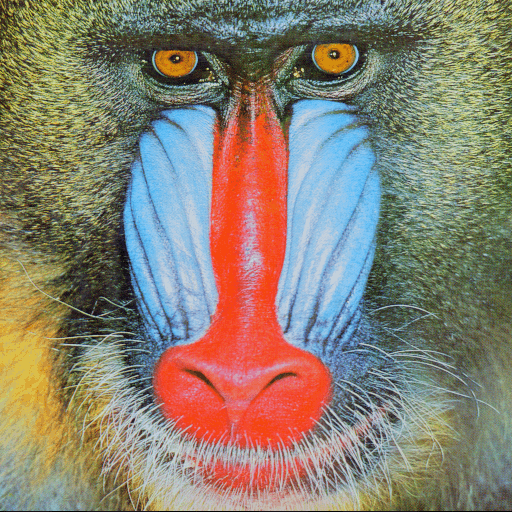

# K-means Image Color Quantizer

Convert 24-bit true color images to high-quality 8-bit indexed color (256 colors or less) using K-means clustering algorithm. Produces superior results compared to standard palette reduction methods by intelligently selecting optimal colors for each specific image.

## Example

| Original (24-bit) | K-means Quantized (8-bit, 256 colors) |
|-------------------|---------------------------------------|
|  |  |

*K-means intelligently selects the optimal 256-color palette for each image*

## Features

- **Smart color selection** - K-means algorithm analyzes your image and selects the best palette
- **Memory efficient** - Batched processing handles large images without excessive RAM usage
- **Optional dithering** - Floyd-Steinberg error diffusion for smoother gradients
- **Multiple formats** - Supports PNG and BMP output
- **Palette export** - Save palettes as Adobe Color Table (.ACT) files
- **Configurable** - Adjust color count, batch size, and iterations

## Requirements

```bash
pip install numpy pillow
```

- Python 3.6+
- NumPy
- Pillow (PIL)

## Installation

1. Download `kmeans_8bit.py`
2. Install dependencies: `pip install numpy pillow`
3. Run from command line

No installation required - it's a standalone script.

## Usage

### Basic Usage

Convert image to 256-color indexed PNG:
```bash
python kmeans_8bit.py photo.png
```

Output: `photo_8bit.png`

### Common Options

**Specify output file:**
```bash
python kmeans_8bit.py photo.png -o output.png
```

**Use fewer colors:**
```bash
python kmeans_8bit.py photo.png -c 128
```

**Apply dithering for smoother gradients:**
```bash
python kmeans_8bit.py photo.png -d
```

**Save as BMP:**
```bash
python kmeans_8bit.py photo.png -f BMP -o output.bmp
```

**Export palette as .ACT file:**
```bash
python kmeans_8bit.py photo.png --save-palette
```

**Reduce memory usage (for very large images):**
```bash
python kmeans_8bit.py huge_photo.png -b 2000
```

### All Command-Line Options

```
positional arguments:
  input                 Input PNG/BMP/JPG image path

options:
  -h, --help            Show help message
  -o OUTPUT, --output OUTPUT
                        Output image path (auto-generated if omitted)
  -c COLORS, --colors COLORS
                        Number of colors (2-256, default: 256)
  -d, --dither          Apply Floyd-Steinberg dithering
  -f {PNG,BMP}, --format {PNG,BMP}
                        Output format (default: PNG)
  -b BATCH_SIZE, --batch-size BATCH_SIZE
                        Pixels per batch - lower uses less RAM (default: 5000)
  --save-palette        Save palette as .ACT file
  -i ITERATIONS, --iterations ITERATIONS
                        K-means iterations (default: 30)
```

## Examples

### Example 1: Basic Conversion
```bash
python kmeans_8bit.py landscape.png
```
Converts `landscape.png` to `landscape_8bit.png` with 256 colors.

### Example 2: High-Quality Web Graphics
```bash
python kmeans_8bit.py screenshot.png -c 64 -d
```
Creates a 64-color version with dithering - great for reducing file size while maintaining quality.

### Example 3: Retro Game Assets
```bash
python kmeans_8bit.py sprite.png -c 16 -f BMP -o sprite_indexed.bmp --save-palette
```
Creates a 16-color BMP and exports the palette for use in game development tools.

### Example 4: Large Images on Low-Memory Systems
```bash
python kmeans_8bit.py huge_photo.jpg -b 2000 -i 20
```
Processes large images with smaller batches and fewer iterations to reduce memory usage.

### Example 5: Batch Processing
```bash
# Linux/Mac
for file in *.png; do python kmeans_8bit.py "$file" -d; done

# Windows (PowerShell)
Get-ChildItem *.png | ForEach-Object { python kmeans_8bit.py $_.Name -d }
```

## How It Works

### K-means Clustering

The script uses K-means clustering to find the optimal color palette:

1. **Initialization**: Randomly selects initial palette colors from the image
2. **Assignment**: Each pixel is assigned to its nearest palette color
3. **Update**: Palette colors are recalculated as the average of assigned pixels
4. **Iteration**: Steps 2-3 repeat until convergence (colors stop changing significantly)
5. **Quantization**: Final image uses only the optimized palette colors

This approach is superior to fixed palettes or simple color reduction because it adapts to each image's unique color distribution.

### Floyd-Steinberg Dithering

When the `-d` flag is used, the script applies error diffusion dithering:

- Distributes color quantization errors to neighboring pixels
- Creates the illusion of more colors through spatial patterns
- Produces smoother gradients and better overall appearance
- Especially effective when using fewer colors (< 128)

### Memory Optimization

The script processes pixels in batches to avoid loading massive distance matrices into RAM:

- Default batch size: 5,000 pixels (~75 KB per batch)
- Adjustable with `-b` flag for different memory constraints
- Can handle multi-megapixel images on modest hardware

## Output Formats

### PNG (Default)
- Lossless compression
- Smaller file sizes
- Widely supported
- Recommended for most uses

### BMP
- Uncompressed
- Larger file sizes
- Maximum compatibility
- Useful for legacy applications or game development

### ACT Palette Files
- Adobe Color Table format
- 768 bytes (256 RGB triplets)
- Import into Photoshop, GIMP, etc.
- Use with `--save-palette` flag

## Performance Tips

### For Faster Processing
- Use fewer iterations: `-i 15`
- Skip dithering (omit `-d`)
- Use fewer colors: `-c 128`

### For Better Quality
- Use more iterations: `-i 50`
- Enable dithering: `-d`
- Use full 256 colors (default)

### For Large Images
- Reduce batch size: `-b 2000`
- Reduce iterations: `-i 20`
- Consider resizing before processing

## Quality Comparison

| Method | Quality | Speed | Use Case |
|--------|---------|-------|----------|
| **K-means (this script)** | Excellent | Medium | Best overall quality |
| **K-means + dithering** | Excellent+ | Slow | Smooth gradients, photorealistic images |
| **Photoshop "Perceptual"** | Good | Fast | General purpose |
| **Photoshop "Diffusion"** | Fair | Fast | Fixed palette, not adaptive |
| **Median Cut** | Good | Fast | Quick reduction, less optimal palette |

K-means produces better results because it optimizes the palette specifically for your image rather than using predetermined colors.

## Troubleshooting

### "Unable to allocate memory" error
**Solution**: Reduce batch size
```bash
python kmeans_8bit.py photo.png -b 1000
```

### Processing too slow
**Solution**: Reduce iterations
```bash
python kmeans_8bit.py photo.png -i 15
```

### Image looks posterized
**Solution**: Enable dithering
```bash
python kmeans_8bit.py photo.png -d
```

### Colors look wrong
**Solution**: Try more iterations
```bash
python kmeans_8bit.py photo.png -i 50
```

### Output file too large
**Solution**: Use PNG instead of BMP, or reduce colors
```bash
python kmeans_8bit.py photo.png -c 128 -f PNG
```

## Technical Details

### Algorithm
- **Clustering**: K-means with random initialization
- **Distance metric**: Euclidean distance in RGB color space
- **Convergence**: Stops when max centroid shift < 0.5 or max iterations reached
- **Dithering**: Floyd-Steinberg error diffusion (7/16, 3/16, 5/16, 1/16 weights)

### Memory Usage
- **Formula**: `batch_size × n_colors × 3 × 4 bytes` for distance matrix
- **Default**: 5,000 × 256 × 3 × 4 = ~15 MB per batch
- **Batch size 2000**: ~6 MB per batch
- **Batch size 1000**: ~3 MB per batch

### Limitations
- Does not preserve transparency (alpha channel is discarded)
- RGB color space only (no LAB or other color spaces)
- Single-threaded (no GPU acceleration)

## License

This project is licensed under the MIT License - see the [LICENSE](LICENSE) file for details.

## Acknowledgments

Inspired by the K-means vector quantization approach in the [PyPVR](https://github.com/VincentNLOBJ/PyPVR) tool for PowerVR texture compression.

## See Also

- [PyPVR](https://github.com/VincentNLOBJ/PyPVR) - Original inspiration for K-means palette generation
- [Pillow Documentation](https://pillow.readthedocs.io/) - Python Imaging Library
- [K-means Clustering](https://en.wikipedia.org/wiki/K-means_clustering) - Algorithm overview
- [Floyd-Steinberg Dithering](https://en.wikipedia.org/wiki/Floyd%E2%80%93Steinberg_dithering) - Dithering technique

---

**Version**: 1.0  
**Last Updated**: December 2025
